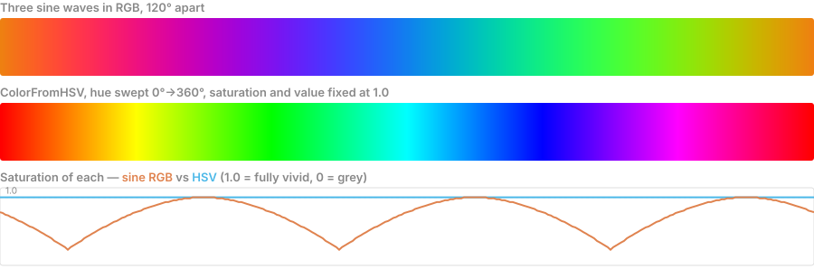

# 02 — Window and Color

Goal: a window whose background color changes over time, with no input.

Sounds trivial. It contains the two ideas that every frame of every game you ever
write is built on.

## C++ you'll meet here

- **Brace initialization** — `Color c{255, 0, 0, 255}`. raylib's structs are plain C
  structs, so this is how you build one. Braces also *reject* narrowing conversions,
  which matters immediately for the next item.
- **`unsigned char`** — each `Color` channel is 0-255. Assigning a `float` or an
  out-of-range `int` needs a deliberate conversion, not a hope.
- **`static_cast<T>`** — the conversion you want when mapping `sin()`'s -1.0..1.0
  onto 0..255. Writing it explicitly forces you to think about the rounding.
- **`float` vs `double`** — `GetTime()` returns `double`, `<cmath>`'s `sin` prefers
  `double`, raylib's API is `float`. Mixing them is where `-Wextra`'s
  narrowing-conversion warnings come from.
- **`constexpr`** — for compile-time constants like screen width. Prefer it over
  `#define`: it's typed and scoped, where a macro is neither.
- **`<cmath>`** — `sin`, `cos`, `fmod`. Note it's `<cmath>`, not `<math.h>`, in C++.

Fuzzy on any of these? [01a — C++ Refresher](01a-cpp-refresher.md) sections 4, 6 and 11.

## The shape of the program

Four regions, in order:

1. **Include and set up.** Include the header. Call the init function with width,
   height, title. Optionally set a target framerate — think about *why* a library
   would need you to state that, rather than just running as fast as possible.
2. **The loop.** A `while` whose condition is a raylib function meaning "has the
   user tried to quit?" (ESC or the close button). This is the game loop.
3. **Inside the loop, a Begin/End drawing pair.** All drawing calls go *between*
   them. This will feel like pointless ceremony. It is not — see below.
4. **After the loop, close the window.** Cleanup.

Functions to find in `raylib.h`: `InitWindow`, `WindowShouldClose`, `SetTargetFPS`,
`BeginDrawing`, `EndDrawing`, `ClearBackground`, `CloseWindow`. Grab `DrawText` too,
so you can see something other than flat color.

## Idea 1 — Your program is a loop now, not a script

Coming from scripts and request handlers, this is the shift: the program is not
"do a thing, exit." It is "do a thing sixty times a second, forever, until told to
stop." Everything that persists must live *outside* the loop; everything that
happens lives *inside* it. Chapter 03 pushes on that distinction hard.

## Idea 2 — Immediate mode: the screen is a function of your state

There is no scene graph. No `addChild`, no retained display objects, nothing
persists between frames. Every frame you wipe the screen and re-issue **every**
draw call from scratch.

Coming from the DOM this is backwards, and it is the thing to internalise:

> The screen is a pure function of your state, recomputed 60 times a second.

Nothing on screen "exists." Stop drawing it and it is gone that instant.

That is why `ClearBackground` belongs *inside* the loop, not in setup.

**Do this deliberately once:** draw a moving shape, then comment out the clear.
Watch it smear trails across the window — those are old frames nobody erased.
You will never mis-model this again after seeing it.

## Idea 3 — Why Begin/End exists: double buffering

You are not drawing to the screen. You are drawing to an off-screen buffer.
`EndDrawing` swaps that finished buffer with the one currently displayed, in one
atomic flip.

If you drew straight to the visible screen, the user would watch your background
paint over the old frame, then your shapes pop in one at a time — flicker and
tearing. The Begin/End pair is the boundary of *"one complete frame, assembled in
private, shown all at once."*

This also explains why drawing outside the pair silently does nothing, which is
the usual cause of "my window is just black."

## The colors part — actually explore

Getting one window open is not the exercise. Do all four:

1. **Named colors.** raylib ships ~25 as macros — `RAYWHITE`, `MAROON`, `SKYBLUE`,
   `DARKPURPLE`. Find the list in the header. Note they are `Color` *values*, not
   an enum.
2. **Build one yourself.** `Color` is a plain struct of four `unsigned char`s:
   red, green, blue, alpha, each `0–255`. raylib is a C library, so no
   constructors — brace-initialise it. Work out how to pass an arbitrary color
   straight into `ClearBackground`.
3. **Make it move.** Find `GetTime()` — seconds since start, as a `double`. Run it
   through `sin()` (`#include <cmath>`) to oscillate a channel. Watch the window
   breathe. Note the range mismatch: `sin` gives you −1…1 and you need 0…255.
   Fixing that mapping yourself is the point.
4. **Then do it properly with HSV.** Find `ColorFromHSV` in the header and cycle
   *hue* instead of RGB. Compare the two side by side. RGB cycling looks muddy and
   passes through grey; HSV cycling looks like a rainbow. That difference is a real
   graphics insight about color spaces, not trivia.

Here is what the two actually look like, and the measurable difference between them:

Both produce a smooth, evenly-paced rainbow that wraps seamlessly — the sine version's
hue advances within 3% of perfectly uniform, so it is a genuinely good approximation.
The difference is **saturation**: HSV holds it flat at 1.0 by construction, while the
sine version scallops between 0.75 and 1.0, dipping at each of the three points per
cycle where two waves cross. Those dips are where the colour goes slightly chalky, and
the sine version never reaches a pure primary — there is always some of all three
channels present.

So the case for HSV is not mainly that it looks better. It is that hue, vividness and
brightness become **independent knobs**: "same rainbow but dimmer" is one number in
HSV, and a re-derivation of all three waves in RGB. That idea generalises well past
colour — pick the coordinate system in which your problem's variables stop interfering
with each other.

Step 3 is the first time you write **`state = f(time)` inside a loop that redraws
everything.** That pattern is every game you will ever write. The colors are an
excuse.

## macOS gotchas

- The window sometimes opens **behind** your terminal. Cmd-Tab before assuming
  it's broken.
- On a Retina display an 800×600 window may look soft. Look for `SetConfigFlags`
  and the `FLAG_WINDOW_HIGHDPI` flag — and note it must be called *before*
  `InitWindow`. Think about why ordering matters for a flag like that.
- Window flashes and vanishes → your loop condition is wrong or missing.
- Black window, nothing in it → you're drawing outside the Begin/End pair.

## Windows gotchas

- First run may trip Windows Defender / SmartScreen on an unsigned exe. Expected.
- If you get a console window *behind* your game window, that's the default
  subsystem. Leave it for now — it's where your debug prints go, and you'll want
  them. Chapter 16 deals with hiding it.

## Exercises

1. **Channel by channel.** Write a function taking three `float`s in 0.0-1.0 and
   returning a raylib `Color`. Decide what it does with out-of-range input, and make
   that decision explicit rather than accidental.
2. **The mapping problem.** `sin()` gives -1.0 to 1.0; you need 0 to 255. Write the
   conversion, then check the endpoints: what does your code produce at exactly -1.0
   and exactly 1.0? Off-by-one at 256 wraps to 0 and shows as a colour glitch at the
   peak of the cycle.
3. **Phase-shifted channels.** Drive R, G and B from the same `GetTime()` but offset
   each by a different phase. Compare against cycling hue via `ColorFromHSV`. Write
   down why one looks muddy.
4. **Deliberate breakage.** Comment out `ClearBackground` and draw a moving shape.
   Watch the smearing. This is the one exercise in the roadmap whose whole purpose is
   to see something look wrong.
5. **Constants.** Replace every magic number (width, height, target FPS, cycle speed)
   with a named `constexpr`. Then try `#define` for one of them and articulate what
   you lost.

## Definition of done

- [x] Window opens on macOS
- [x] Window opens on Windows
- [x] Background is a color I built from raw RGBA numbers
- [x] Background cycles over time using `GetTime()`
- [ ] I tried the HSV version and can explain why it looks better
- [ ] I deliberately removed `ClearBackground` and saw the smearing

Next: [03 — Input, State and Motion](03-input-state-motion.md)
