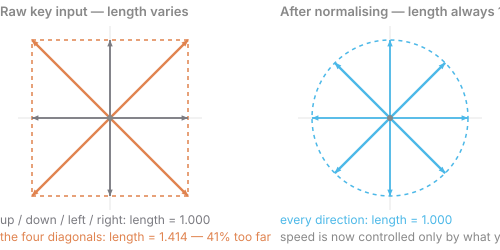

# 03 — Input, State and Motion

Goal: a shape you move with the keyboard. The real goal: understanding where state
lives.

## C++ you'll meet here

- **Pass by reference** — `void applyInput(Vector2& pos)` mutates the caller's value;
  `Vector2 pos` mutates a copy and silently does nothing. This is the chapter where
  that distinction stops being theory.
- **Returning structs by value** — `Vector2 readInput()` is the cleaner shape, and
  the copy is free in practice. Prefer it over an out-parameter.
- **`std::clamp`** (`<algorithm>`, C++17) — for keeping the shape on screen. Note the
  argument order and that it returns rather than mutates.
- **Operator overloading** — `raymath.h` gives you `Vector2Add(a, b)`. Writing your
  own `operator+` for `Vector2` so you can say `a + b` is a good first taste, and it
  shows you what raymath chose *not* to do (raylib is C; C has no operator overloading).
- **`const` on parameters** — `float length(const Vector2& v)` says "I read this, I
  don't copy it, I don't change it."
- **Division by zero in floats** — normalising a zero-length vector gives you `inf`
  or `NaN` rather than a crash, and `NaN` propagates silently through every later
  calculation. This is a genuinely nasty failure mode.

Fuzzy? [01a — C++ Refresher](01a-cpp-refresher.md) sections 1, 2, 3 and 7.

## The core exercise

Draw a rectangle or circle. Move it with the arrow keys or WASD. That's it.

Functions to find in `raylib.h`: `DrawRectangle`, `DrawCircle`, `DrawRectangleV`,
`IsKeyDown`, `IsKeyPressed`, and the `KeyboardKey` enum (`KEY_W`, `KEY_RIGHT`, …).

## The thing to get right: state lives outside the loop

Your position variables are declared **before** `while`, mutated **inside** it.
Declare them inside and they reset every frame — the shape never moves, and the bug
looks like "input isn't working."

Write it wrong on purpose once. Then say out loud what the loop body actually is:
a function from (old state, input) to (new state, pixels).

## `IsKeyDown` vs `IsKeyPressed` — polling vs events

This distinction matters more than it looks.

- **`IsKeyDown`** — is the key held *right now*? True on every frame it's held.
  For continuous things: movement, holding a trigger, charging a jump.
- **`IsKeyPressed`** — did it transition up→down *this frame*? True exactly once
  per physical press. For discrete things: jump, shoot, toggle pause, menu select.

You have no `onKeyDown` callback here. raylib does not push events at you; you
**poll** the current input state at a moment you choose. That is a deliberate
design that fits the loop model — at the top of each frame you ask "what is true
now?" rather than accumulating a queue of things that happened whenever.

Use `IsKeyDown` for pause and you'll pause/unpause 60 times a second and see a
flickering mess. Do it once so the difference is muscle memory.

## Diagonal movement: your first real bug

Move right → speed 5. Move right *and* up → speed 5 right plus 5 up, which is
5·√2 ≈ 7.07 total. Diagonal movement is 41% faster.

### What "normalise" actually means

A `Vector2` is two numbers describing **one arrow**. An arrow carries two separate
pieces of information: **which way** it points (direction) and **how long** it is
(magnitude). Normalising means *keep the direction, force the length to exactly 1*.

Here is the whole problem and the whole fix in one picture:

Build a direction straight from key presses and each component is `-1`, `0` or `+1`.
The four cardinal directions come out length `1`, but the four diagonals come out
length `√2 ≈ 1.414`. The eight endpoints trace a **square**, not a circle — and the
corners of a square are further from the centre than its edges are.

**Why that matters:** your direction is secretly carrying speed information. When you
then multiply by `speed`, you are multiplying by *speed × whatever length the
direction happened to have*. Diagonals get a free 41% bonus.

Normalising divides the vector by its own length, which forces every direction onto a
**circle** of radius 1. Now direction carries *only* direction, and `speed` is the
only thing that decides how fast. Two responsibilities that were tangled together
become independent — the same idea as separating hue from brightness in chapter 02.

The arithmetic is just Pythagoras:

- length of `(x, y)` is `√(x² + y²)`
- divide both components by that length
- `(1, 0)` has length `1` → unchanged
- `(1, 1)` has length `√2` → becomes `(0.707, 0.707)`

That `0.707` is `1/√2`. If you special-cased diagonals by multiplying by `√0.5` you
found the right answer for the 45° case — normalising is the same answer, derived
rather than hardcoded, and it also works for a gamepad stick held at 17°.

**The one thing to get right:** a zero-length vector cannot be normalised — you would
divide by zero. When no keys are held, `(0, 0)` has length `0`. Decide what your code
does there *before* you run it.

Fixing it teaches you the one piece of math games actually require:

1. Build the input as a **direction vector** — x from left/right keys, y from
   up/down — instead of moving on each axis independently.
2. **Normalise** it: divide by its length so it's always length 1 (or zero).
3. Multiply by speed.

Look for `Vector2` in `raylib.h` — a struct of two `float`s. Then look at
`raymath.h` (ships with raylib, separate header) for `Vector2Normalize`,
`Vector2Add`, `Vector2Scale`, `Vector2Length`.

**Write the normalise yourself first, then switch to `raymath.h`.** You need to
know what it does, and you need the guard: normalising a zero-length vector divides
by zero. What does your code do when no keys are held? Find out before it bites you.

## Screen coordinates

+Y points **down**. Origin is top-left. Pressing "up" *decreases* y.

This is near-universal in 2D graphics and it will still confuse you for a week.
Say it out loud each time until it sticks.

## Push a little further

- Clamp the shape inside the window (`GetScreenWidth`, `GetScreenHeight`). Notice
  you must account for the shape's own size, and that a rectangle's x/y is its
  *corner* while a circle's is its *centre*. That asymmetry causes real bugs later.
- Add a second shape with different keys. Notice the copy-paste. **Do not abstract
  it yet** — just notice, and remember the rule: three times, then extract.
- Print the position with `DrawText` and `TextFormat` (raylib's `sprintf`-alike).
  A permanent on-screen readout of your state is the cheapest debugging tool you
  will ever build, and chapter 13 turns it into a real overlay.

## Exercises

1. **Prove the copy bug.** Write your movement function taking `Vector2` by value
   first. Watch the shape not move. Then add one character. You will make this
   mistake for real later; make it cheaply now.
2. **Normalise by hand.** Write `Vector2Normalize` yourself before using raymath's.
   Then feed it `{0, 0}` and print the result. Is it `nan`? Now decide what your code
   *should* do with no input held, and make it do that.
3. **NaN propagation.** Take that `nan` position and add to it, multiply it, clamp it.
   Print at each step. Notice `nan` survives everything and that comparisons against
   it are all false — including `nan == nan`.
4. **Operator overloading.** Add `operator+`, `operator-` and `operator*` (by scalar)
   for `Vector2`. Rewrite your movement using them. Decide whether it reads better;
   there's a real argument either way.
5. **Corner vs centre.** Put a rectangle and a circle on screen and clamp both inside
   the window. The rectangle's x/y is its corner, the circle's is its centre. Getting
   both right is a five-minute exercise that prevents a recurring class of bug.

## Definition of done

- [ ] A shape moves with the keyboard
- [ ] Diagonal speed equals straight-line speed
- [ ] I can explain `IsKeyDown` vs `IsKeyPressed` and have used both
- [ ] The shape can't leave the window
- [ ] Position is displayed on screen
- [ ] I know what my normalise does when no keys are held
- [ ] Reviewed against [the code review rubric](CODE-REVIEW.md) — tier 1 and 2 clear

Next: [04 — Delta Time](04-delta-time.md)
